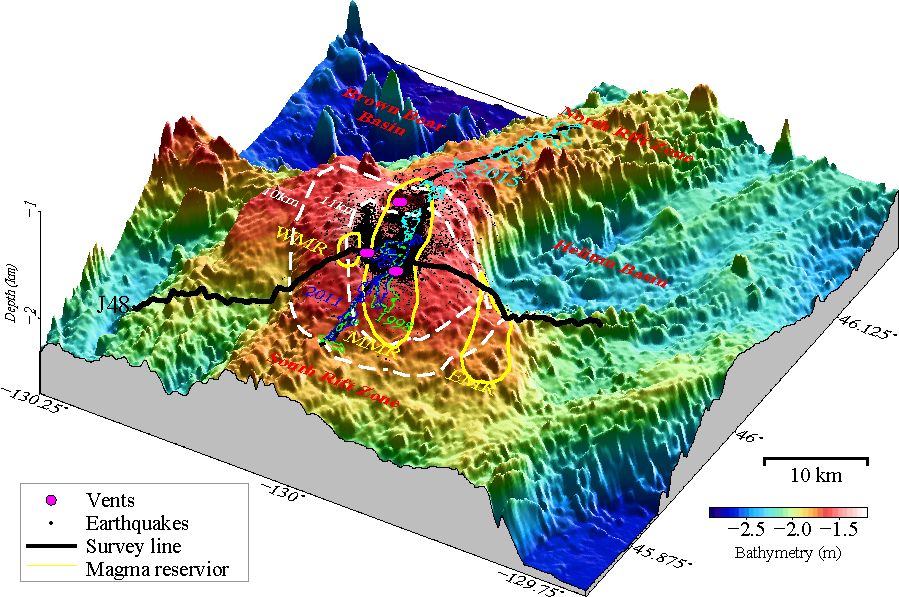

# AxialSeamountFwiModel
 
We present the models of P-wave velocity and attenuation as well as estimates of temperature and partial melt based on an advanced multiparameter full-waveform inversion across the Axial Seamount along Juan de Fuca ridge. The main magma reservoir, secondary magma reservoir and a small magma reservoir beneath the western caldera wall are imaged at high resolution. A low-velocity throat beneath the eastern wall, connecting the MMR roof with eruptive fissures on the seafloor, is identified. These findings reveal an asymmetric shallow plumbing system beneath Axial Seamount, shedding light on the magma pathways that fed recent eruptions.

